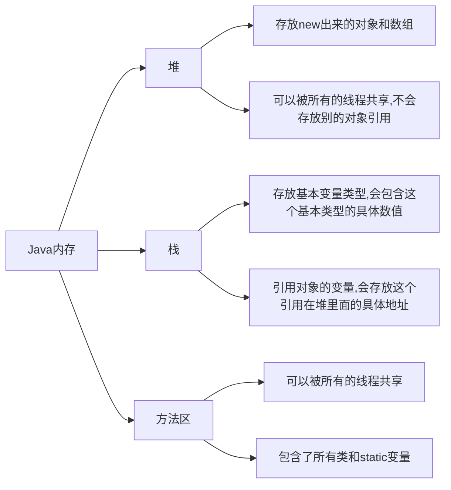

# 前言

​	这篇博客用于Java基础学习，每次更新笔记时需记录当前更新时间..

# 笔记区

## 数据类型拓展

1. 整数拓展

```java
   		//整数拓展(进制)
           int i= 10;//10进制
           int i2 = 010;//8进制
           int i3 = 0x10;//16进制
           int i4 = 0b10;//2进制
           System.out.println(i+" "+i2+" "+i3+" "+i4);//10 8 16 2
```

   

2. 浮点数拓展

   + float特点:有限 离散 舍入误差 大约 接近但不等于*

   + ***最好完全避免使用浮点数进行比较,见以下案例***

```java
   		float d1 = 138912478f;
   		float d2 = d1 + 1;
   		System.out.println(d1==d2);//打印结果为true,是不是很惊讶
```

   **银行表示钱用什么？*BigDemical数学工具类* **

3. 字符拓展

   + 所有的字符本质还是数字

     编码:

     Unicode|65=A,97=a|2字节|0-65536(2<sup>16<sup>)
```java
//字符拓展
char c1= '\u0061';//注意char类型要用'
System.out.println(c1);//a
```

4. Less is more 大道至简

```java
//布尔拓展
boolean bool=true;
if(bool=true){};
if (bool){};//精简
```

## 类型转换

1.  强制类型转换  高->低
2. 自动类型转换   低->高

注意:

+ 不能对布尔值进行转换
+ 不能把对象类型转化为不相干的类型
+ 高容量转换成低容量类型时,强转
+ 强转时注意数据类型范围,超出低容量范围时会发生溢出,如下

```java
int a = 128;
byte b = (byte)i;
System.out.println(b);//-128,因为发生了内存溢出
```

## 溢出问题

+ 操作比较大的数时注意溢出问题

+ JDK7特性,数字之间可用下划线分割
 ```java
//溢出问题
int money = 10_0000_0000;
int years = 20;
int total1 = money * years;//-1474836480,溢出
long total2 = (long)money * years;//不溢出
System.out.println(total1);
 ```

## Javadoc

Javadoc 用来生成自己api文档

1. 命令行生成 

```shell
javadoc -encoding UTF-8 -charset UTF-8 Java文件名.java
```

在方法上使用文档注释标注参数信息

*参数信息*:

+ @author 作者名
+ @version 版本名
+ @since 指明最早需要使用的jdk版本
+ @param 参数名
+ @return 返回值情况
+ @throws 异常抛出情况

2. Idea生成

​		打开菜单->tools->generate Javadoc

```monki
2023-7-20 编辑所有内容至此
```

## 命令行传递参数

```Java
package com.monki.javabase;

public class CommandArg {
    public static void main(String[] args) {
        for (String arg:args){
            System.out.println(arg);
        }
    }
}
```

若当前Java文件有包名,直接在Java文件所在路径下用命令行执行会报错


正确执行方法:进入到src目录,在类名前加上包名,如图

## 可变参数

- jdk1.5开始,JAVA支持传递同类型的可变参数给一个方法
- 在方法声明中,在指定参数类型后加...
- 一个方法<mark>只能指定一个</mark>可变参数,它<mark>必须是方法的最后一个参数</mark>,<mark>任何</mark>普通参数需在其前面声明
- 可变参数的<mark>本质是数组</mark>

```java
package com.monki.javabase;

public class VariableArg {
    public static void main(String[] args) {
        new VariableArg().printMyArg("下面是我的可变长参数",4536251,1433223);
    }
    public void printMyArg(String s,int... i){
        System.out.println(s);
        for (int x:i){
            System.out.println(x);
        }
    }
}
```

## 数组内存分析





## 接口

只有规范!无法写自己的方法~专业的约束! 约束和实现分离:面向接口编程~

<mark>接口的本质是契约</mark>

作用:

1. 约束
2. 定义一些方法,让不同的人实现
3. 方法 public abstract
4. 变量 public static final
5. 接口不能被实例化,因为接口中没有构造方法
6. implement可以实现接口
7. 必须要重写接口中的方法

```java
package com.monki.javabase;
//锻炼抽象的思维,能通过接口定义一个系统时,你的架构能力就很强了
//interface定义的关键字,接口都需要有实现类
public interface InterfaceStudy {
    //常量 public static final
    int AGE=99;
    //接口中所有定义的方法都是抽象的(默认:public abstract)
   void run(String name);
   void delete(String name);
   void update(String name);
   void query(String name);
}

package com.monki.javabase;

public interface TimeService {
    void timer(); 
}

package com.monki.javabase;

//类 可以通过implements实现接口
//实现了接口的类,必须重写接口中的方法
//利用接口实现多继承
public class InterfaceStudyImpl implements InterfaceStudy,TimeService{

    @Override
    public void run(String name) {

    }

    @Override
    public void delete(String name) {

    }

    @Override
    public void update(String name) {

    }

    @Override
    public void query(String name) {

    }

    @Override
    public void timer() {

    }
}

```


# 心得区


# 音乐分享

<div></div>
